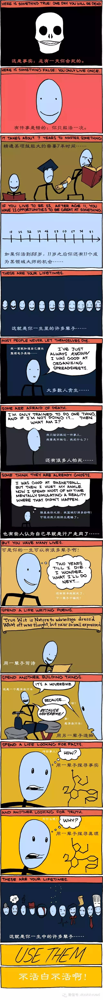

# 前言

我是如何变成今天的我？
这里的今天，在中文表达上是动词。

我很喜欢李笑来讲的[**七年就是一辈子**](https://b.xinshengdaxue.com/Preface.html)，过了35岁之后，开始真正意识到，剔除模板化的少年，和走不动的老年，自主掌控的生命短暂，李笑来提供了一个很好的视角和答案，就是把人生切片，七年一辈子。

>我们相信七年就是一辈子，一生可以有很多辈子 —— 可以做很多事情，过很多不一样的生活……

人一辈子干一件事情是多么浪费生命的举动，所以我希望自己能重生，能真正进入重生循环。
> 业余（Non-Professional）
> 
> 重生（Reborn）
> 
>再生（Reborn Again）
> 
> 反复重生（Reborn Again and Again）
> 
最后他把这个观点落地到学习上，学习才能让自己成为一个不同的人。

我计划用这个站点记录我的重生，希望若干年后，给自己留下点滴记录。

---
 2023年2月27日  -- 上海
 
