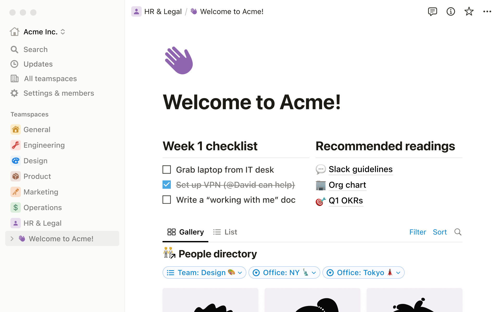
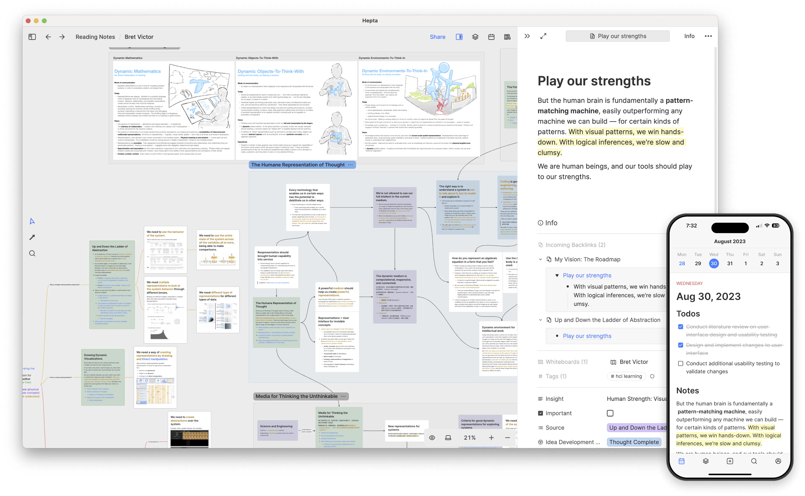

# 工具

## 我的工具箱🎁

## 管理工具
- [Notion](https://noiton.io/)：管理个人知识库的工具，可以用来整理笔记、计划、任务、日程等
  - 
- [Heptabase](https://heptabase.com/)：知识库管理神器
  - 
## 开发工具
- [MDX Editor](https://editor.runjs.cool/)：一个微信排版编辑器，使用 MDX